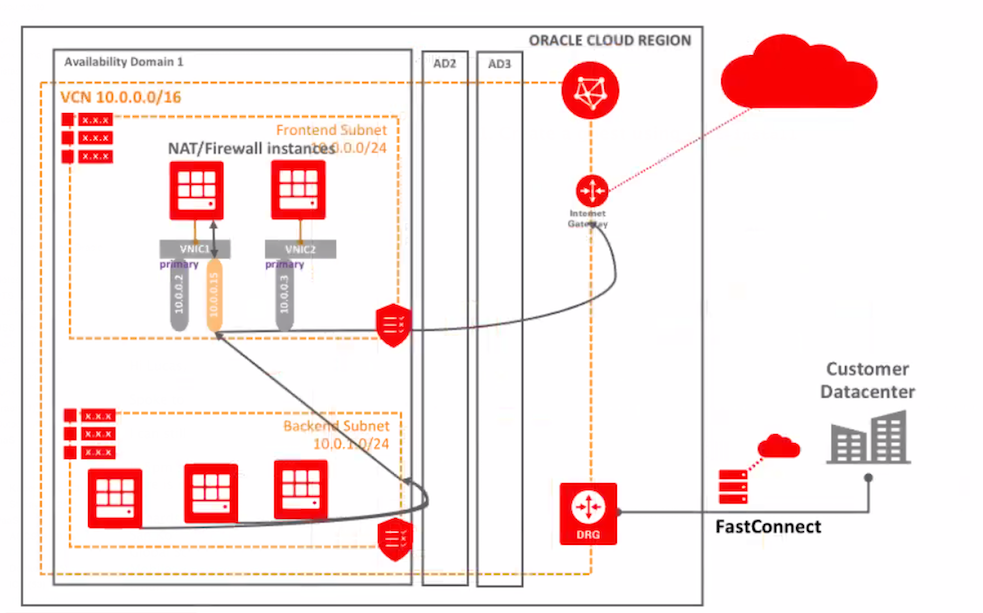

KVM Virtualization
==================

This sample uses Terraform to demonstrate the Bring Your Own Hypervisor model to deploy custom KVM based Virtual Machines on top of a KVM hypervisor on Oracle Cloud Infrastructure.

In this example we demonstrate the automatic installation of a [Web Application Firewall - WAF](https://en.wikipedia.org/wiki/Web_application_firewall) running on Oracle Cloud Infrastructure (OCI) based on the network topology described on the diagram below, but it can be easily adapted to automate the installation of any Virtual Machine based on KVM:



This sample code will be responsible to perform the following tasks:

- Setup of all required network components: VCN, Internet Gateway, frontend & backend subnets, and security lists

- Spin up a [Bare Metal](https://docs.us-phoenix-1.oraclecloud.com/Content/Compute/Concepts/computeoverview.htm) Instance based on Oracle Linux 7.x image

-	Installation of the KVM hypervisor provided by the Linux Kernel available as a [Terraform module](https://www.terraform.io/docs/modules/usage.html) (reusable artifact). This process requires instance restart due to the kernel changes. You can find detailed information about how to setup KVM on OCI [here](https://docs.us-phoenix-1.oraclecloud.com/Content/Resources/Assets/installing_kvm_multi_vnics.pdf). Module documentation containing the list of input variables and Module usage is available [here](./modules/kvm-hypervisor/README.md).

-	Download of the qcow2 image. In case you have your image file stored on your local computer, you can upload it to a [Bucket](https://docs.us-phoenix-1.oraclecloud.com/Content/Object/Tasks/managingbuckets.htm) on the [OCI Object Storage](https://docs.us-phoenix-1.oraclecloud.com/Content/Object/Concepts/overview.htm).

Requirements
------------

- Access to OCI environment
- [Generated OCI keys and OCIDs](https://docs.us-phoenix-1.oraclecloud.com/Content/API/Concepts/apisigningkey.htm)
- Terraform 0.10.x


### Usage

- Update `terraform.tfvars` with the required information. Terraform automatically loads them to populate variables, but you can also use the -var-file flag directly to specify a file. These files are the same syntax as Terraform configuration files. And like Terraform configuration files, these files can also be JSON.

We don't recommend saving usernames and password to version control, but you can create a local secret variables file and use -var-file to load it.

Most examples use the same set of environment variables so you only need to do this once. There's a sample file available on this sample code for your reference in addition to the snippet below:

```
###############################
#### Environment variables ####
###############################
tenancy_ocid="<tenancy OCID>"
compartment_ocid="<compartment OCID>"
user_ocid="<tenancy OCID>"
fingerprint="<PEM key fingerprint>"
ssh_private_key_path="<path to the ssh private key to ssh to the instance>"
ssh_public_key_path="<path to the ssh public key to setup on the instance>"
region="<OCI region>"

#######################################
#### Instance definition variables ####
#######################################

#Customer Identifier to be used before the resources name
customer_name = "mycustomer"

#availability_domain number For AD1 uses 1. For AD2, uses 2, For AD3, uses 3
availability_domain = "1"

#Only BM Shapes are supported
instance_shape = "BM.Standard1.36"


##############################
#### KVM related settings ####
##############################

#URL of your image file (you can place your image in the object storage!)
kvm_image_url = "<my-qcow2-image-url>"
kvm_image_name = "my-qcow2-image.qcow2"
kvm_image_path = "/kvm-imgs/"

kvm_guest_domain_name = "MyDomain"
kvm_guest_memory = "16384"
kvm_guest_vcpu = "8"
kvm_emulation_mode = "virtio"
kvm_guest_os_type = "linux"
kvm_guest_vnc_port = "5901"
kvm_guest_vnc_pwd = "Test123"
```

- After saving your environment variables, you should run terraform following the same order as specified below:

- Run `terraform get` to bring the module files into the current workspace

- Run `terraform init` to download all the providers/plugins files

- Run `terraform plan`

- Run `terraform apply`

- Create a Tunnel over SSH to establish a VNC connection to access the guest VM

```
ssh -i <ssh-private-key> -L <vnc_port>:localhost:<vnc_port> opc@<kvm_host_public_ip>
```

You can create a simple shell script to retrieve the kvm host from the `terraform output`

```
#!/bin/bash
export kvm_host=`terraform output KVM_HOST_PUBLIC_IP`

ssh -i <ssh-private-key> -L $TF_VAR_kvm_guest_vnc_port:localhost:$TF_VAR_kvm_guest_vnc_port opc@$kvm_host
```

-	Access your Guest Instance. You can retrieve the KVM Guest public IP running the terraform output command as well:

```
$ terraform output KVM_GUEST_PUBLIC_IP
```
