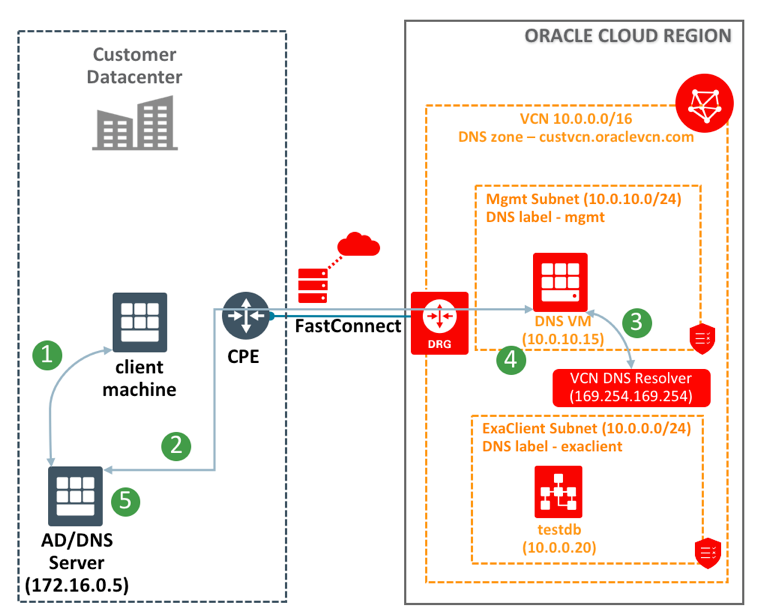
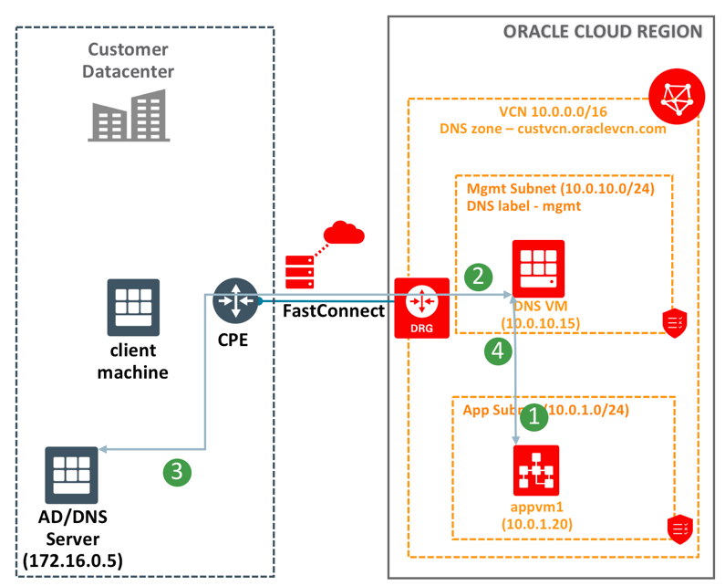
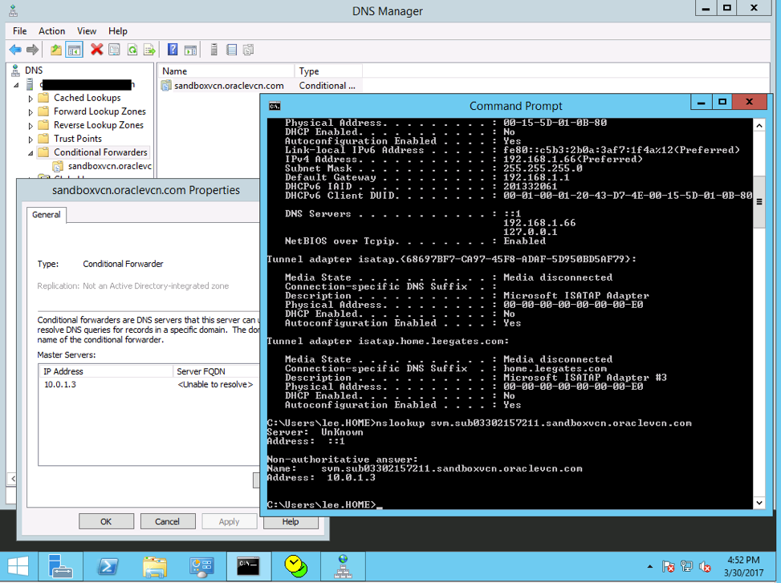

# Hybrid DNS Configuration

Oracle Cloud Infrastructure (OCI) customers can configure DNS names for their instances in the Virtual Cloud Network (VCN) as described in [DNS in Your Virtual Cloud Network](https://docs.us-phoenix-1.oraclecloud.com/Content/Network/Concepts/dns.htm). The DNS names are resolvable only within the VCN using the VCN DNS resolver available at 169.254.169.254. This IP address is only reachable from instances in the VCN.

This document describes the process to enable resolution of DNS names of instances in the VCN from on-premises clients and vice-versa, when the on-premises datacenter is connected with the VCN (through VPN or FastConnect).

## Setup Overview


### Case1 – DNS resolution from on-premises to VCN



When an on-premises client is trying to connecting to cloud VCN resources:

1. Client machine initiates a DNS query (for db1.exaclient.custvcn.oraclevcn.com) to on-prem DNS server (172.16.0.5)
2. On-prem DNS server forwards the request to DNS VM in the VCN (10.0.10.15) over private connectivity (VPN or FastConnect)
3. DNS query forwarded to VCN DNS resolver (169.254.169.254)
4. DNS VM gets the IP address of the FQDN and send it back to on-prem DNS server
5. On-prem DNS server gets the IP address and responds to the client machine


#### Case2 – DNS resolution from VCN to on-premises



When an instance in the VCN is trying to connect to an on-premises instance:

1. Instance in the VCN initiates a DNS query (say app1.customer.net)
2. The DNS server configured in the DHCP options used by the instance&#39;s subnet will receive the DNS request. In this case, the request will be received by DNS VM in the VCN
3. DNS query forwarded to on-premises DNS server (172.16.0.5) over private connectivity (VPN of Fastconnect)
4. DNS VM gets the response and sends it back to client


## Configuration Steps

Below are the steps to achieve this configuration

1. Create a DNS VM in the VCN
   1. Create a security list with following rules:
      * allow udp 53 (for DNS queries) from clients (VCN address space + On-prem address space)
      * allow tcp 22 (for ssh access) from Internet or on-prem address space
      * allow ICMP type3 from same sources as rule above (for ssh access)
    
   2. Create a DHCP options set:
      * Set DNS type as &quot;Internet and VCN resolver&quot;


2. Create a subnet, which uses the security list and DHCP options set created above.
3. Launch a VM with latest &#39;Oracle Linux 7.4&#39; image into this subnet
4. Install &amp; Configure named
```
   $ sudo yum install bind
   $ sudo firewall-cmd --permanent --add-port=53/udp
   $ sudo firewall-cmd --permanent --add-port=53/tcp
   $ sudo /bin/systemctl restart firewalld
   $ cat > /etc/named.conf
options {
        listen-on port 53 { any; };
        allow-query    { localhost; 10.0.0.0/16; 172.16.0.0/16; };
        forward        only;
        forwarders     { 169.254.169.254; };
        recursion yes;
};

zone "customer.net" {
        type       forward;
        forward    only;
        forwarders { 172.16.0.5; 172.16.31.5; };
};

<hit ctrl-D>

   * $ sudo service named restart
```

5. Configure forwarding on the on-prem DNS servers for &#39;VCN domain&#39; (custvcn.oraclevcn.com) to be forwarded to DNS VM in the VCN.
   Below is a snapshot of the setup in an AD/DNS server.
   

