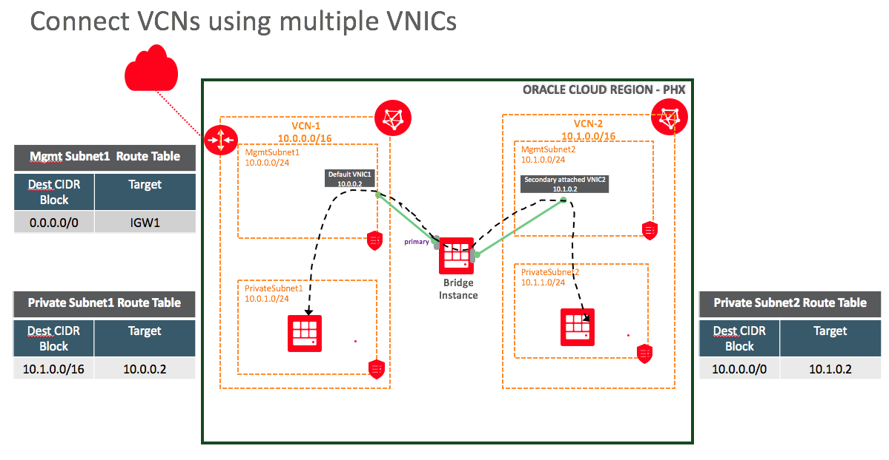

    #     ___  ____     _    ____ _     _____
    #    / _ \|  _ \   / \  / ___| |   | ____|
    #   | | | | |_) | / _ \| |   | |   |  _|
    #   | |_| |  _ < / ___ | |___| |___| |___
    #    \___/|_| \_/_/   \_\____|_____|_____|
***
This example creates 2 VCNs with non-overlapping subnets and establishes connectivity between the 2 using attached VNICs.

Each VCN has a public subnet and a private subnet. Each subnet is created with a separate security list and route table. 
The template then launches a private instance in each one of the private subnets.

A public instance is created in the public subnet of the first VCN. 
The public instance is configured as a Bridge instance (by enabling and configuring firewall to do forwarding).

The first VCN's private subnet's route table is configured to use the Bridge instance's private IP address as the default route target. See [Using a Private IP as a Route Target](https://docs.us-phoenix-1.oraclecloud.com/Content/Network/Tasks/managingroutetables.htm#privateip) for more details on this feature.

A secondary VNIC is created and attached to the Bridge instance. See [Configuring and using Secondary VNIC](https://docs.cloud.oracle.com/iaas/Content/Network/Tasks/managingVNICs.htm) for more details on this feature. This secondary VNIC is attached to the public subnet of the second VCN. Now the Brdige instance has 2 VNICs, 1 is a default VNIC attached to the first VCN and other is the secondary VNIC attached to the second VCN.

The second VCN's private subnet's route table is configured to use the Bridge instance's secondary VNIC's private IP address as default route target. 

### Using this example
* Update env-vars with the required information. Most examples use the same set of environment variables so you only need to do this once.
* Source env-vars
  * `$ . env-vars`
* Update variables in bridge.tf as applicable to your target environment.

Once the environment is built, both the private instances in the different VCNs should be connected. You can login to the public Bridge instance, from there login to the private instances and then ping/SSH the other private instance to verify conectivity between the private instances in different VCNs.

### How to validate this example
Steps to validate this example will also be listed in the output when the terraform is deployed. 
1. Enable ssh forwarding from your machine by performing "ssh-add ~/.ssh/id_rsa"
2. Login to Bridge instance using "ssh -A Bridge_Instance_Public_IP_Address"
3. After that, login to privateInstance-1 using "ssh PrivateInstance-1-IP-Address"
4. Ping the other PrivateInstance-2 "ping PrivateInstance-2-IP-Address"
5. Vice versa should work fine as well.

### Files in the configuration

#### `env-vars`
Is used to export the environmental variables used in the configuration. These are usually authentication related, be sure to exclude this file from your version control system. It's typical to keep this file outside of the configuration.

Before you plan, apply, or destroy the configuration source the file -  
`$ . env-vars`

#### `user_data.tpl`
Enabling and configuring firewall to do forwarding.

#### `bridge.tf`
Defines the bridge instance resources.

#### vcn1.tf
Defines VCN1 resources.

#### vcn2.tf
Defines VCN2 resources.

#### output.tf
Displays the output.
