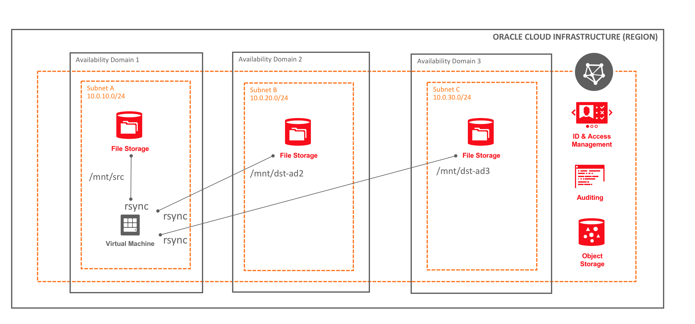
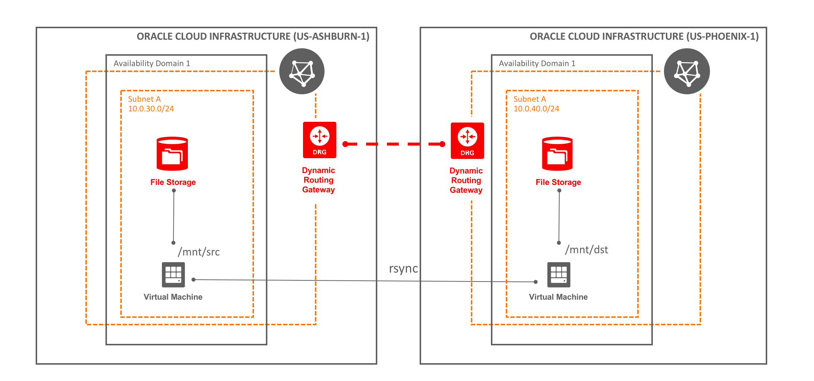

    #     ___  ____     _    ____ _     _____
    #    / _ \|  _ \   / \  / ___| |   | ____|
    #   | | | | |_) | / _ \| |   | |   |  _|
    #   | |_| |  _ < / ___ | |___| |___| |___
    #    \___/|_| \_/_/   \_\____|_____|_____|
***
# Oracle Cloud Infrastructure File Storage Service Data-Replication modules

This example provides a way to replicate data from a File Storage Service File System leveraging cron job in conjunction with [rsync](https://en.wikipedia.org/wiki/Rsync). To enable you to better re-use this code, we create a set of [Terraform](https://www.terraform.io/) modules responsible to replicate the data across two [Oracle Cloud Infrastructure File Storage Service (FSS)](https://docs.us-phoenix-1.oraclecloud.com/Content/File/Concepts/filestorageoverview.htm) shared [File Systems](https://docs.us-phoenix-1.oraclecloud.com/Content/File/Tasks/creatingfilesystems.htm). Each module is responsible for launching one or more compute instances (VMs) and copying the data directly from the `source` FSS File System (or Snapshot folder) to a `destination` FSS File System.

There are 2 typical architectures:

Local Data Sync
---------------

Regional Data Sync
------------------

Click on the link below for more information about how you can use each module:

* [`File System Replication (Local)`](./modules/rsync_filesystem_local/README.md): Data is replicated directly from the source File System (Mount Target) to a destination/target File System (Mount Target).

* [`Snapshot Replication (Local)`](./modules/rsync_snapshot_local/README.md): Snapshot occurs first and then, the data is replicated from the snapshot folder in the source File System to the destination/target File System (Mount Target).

* [`Snapshot Replication (Regional)`](./modules/rsync_snapshot_across_region/README.md): Snapshot occurs first in the source host in region A e.g. Ashburn, then, the data is replicated from the snapshot folder in the source host to the destination/target File System mounted on a host deployed to region B, e.g. Phoenix.

The example on this folder creates VCNs, Subnets and File Systems in 2 different regions (Phoenix and Ashburn) across multiple Availability Domains (in Ashburn only).

### Using this example
* Update env-vars with the required information

* Source env-vars
  * `$ . env-vars`

* In case you want to modify any network setting (e.g. VCN CIDR address), update [`variables.tf`](variables.tf)

* Modify [`modules.tf`](modules.tf). By default, all the 3 modules are executed by Terraform based on scenarios described above (Local and Regional Data Sync). If you don't want to run all the scenarios at one time, you can comment the snippet code referent to the use case plus the output variables returned by the module, declared after the module code snippet. Since each module creates at least 1 VM, you must ensure you have all the compute resources available for executing this example. You can optionally modify the frequency of cron job execution directly in the module configuration.

* Execute [`terraform init`](https://www.terraform.io/docs/commands/init.html) to initialize working directory containing Terraform configuration files.

* Execute [`terraform get`](https://www.terraform.io/docs/commands/get.html) to download and update modules.

* Execute [`terraform plan`](https://www.terraform.io/docs/commands/plan.html) to verify the execution plan containing all the objects will be created, modified or deleted.

* Execute [`terraform apply`](https://www.terraform.io/docs/commands/apply.html) to apply the changes.

* Terraform should create all objects and will finish up the execution only after cloud-init completes the process of setting up the cron-job. This may take awhile because rsync and nfs-utils are installed during the bootstrap process. All the mount points are also mounted at this time. By default, the source File System will be mounted at `/mnt/src_fs_demo` folder and destination folder mounted at `/mnt/dst_fs_demo`.

* After creating all the required resources for running this sample (VCNs, subnets, security lists, route tables, etc), at least one instance will be created. At the end of the execution, both public and private IP address of each instance will be displayed in the console so that you should be able to ssh to the instance to modify the file system. 

* You can write some files in the source file system for testing the data replication
    * Run `sudo touch  file{001..100}.txt`

* Wait for the cron job to finish the execution based on the frequency specified on each module and then check the destination folder (it may be on a different host depending on the use case). In some specific scenarios, a snapshot folder will be created in the source file system.

### Tips
* If you want to destroy the resources managed by one specific module, you can run the following command: terraform destroy -target="module.<module-name>", E.g:
    `terraform destroy -target="module.rsync_snapshot_across_ashburn_phoenix"` - this will destroy the instances created by this module

### Configuration files

#### `env-vars`
Is used to export the environmental variables used in the configuration. These are usually authentication related, be sure to exclude this file from your version control system. It's typical to keep this file outside of the configuration.

Before you plan, apply, or destroy the configuration source the file -  
`$ . env-vars`

#### `provider.tf`
Defines the provider configuration

#### `variables.tf`
Defines the variables

#### `network_iad.tf`
Defines the network resources - VCN, subnets and other related resources in Ashburn region

#### `network_phx.tf`
Defines the network resources - VCN, subnets and other related resources in Phoenix region

#### `fss.tf`
Defines the File Storage Service configuration

#### `locals.tf`
Defines the [local values](https://www.terraform.io/docs/configuration/locals.html) to use within a module

#### `data_source_iad.tf`
Defines the Data Source information related to Ashburn region

#### `data_source_phx.tf`
Defines the Data Source information related to Phoenix region

#### `output.tf`
Shows the IP addresses of each FSS mount target
