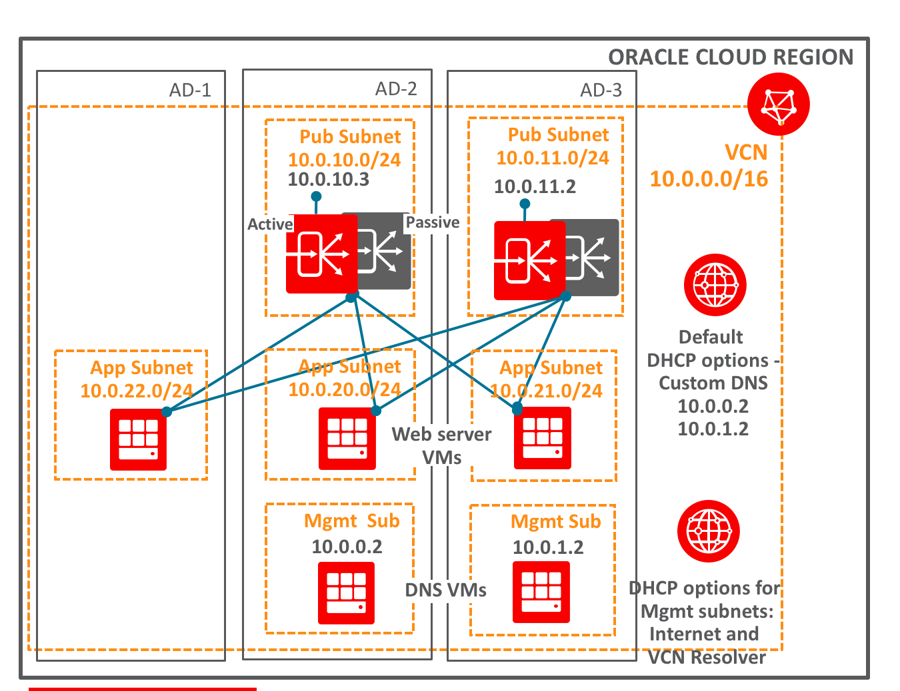

    #     ___  ____     _    ____ _     _____
    #    / _ \|  _ \   / \  / ___| |   | ____|
    #   | | | | |_) | / _ \| |   | |   |  _|
    #   | |_| |  _ < / ___ | |___| |___| |___
    #    \___/|_| \_/_/   \_\____|_____|_____|
***
This example configures regionally highly-available private load balancers using custom DNS servers.

It creates a VCN with the required subnets and other components, and it creates two private load balancers in two availability domains with the same set of backend instances.

It then creates two VMs (in the same ADs but different subnets) and configures them to perform DNS forwarding. It creates a custom domain and adds a round-robin DNS entry which resolves to the two private load balancer IP addresses. It also updates the default DHCP options of the VCN to use the DNS VMs as the custom DNS resolvers. With this setup, all instances in subnets that uses the default DHCP options (or the custom DNS servers explicitly) will be able to use the FQDN as the endpoint (instead of any one private load balancer's IP address). 

It configures [monit](https://mmonit.com/monit/) (an open-source utility to monitor unix systems) on the DNS VMs to check the availability of the private load balancer's listener endpoint. In case the endpoint becomes unavailable, the monitoring service updates the DNS records to remove the private load balancer's IP. 

In case of an AD-level failure or when a private load balancer is down, 'monit' will detect that endpoint is down and remove it from round-robin DNS entries. When clients query for the FQDN, it resolves to the IP address of the other private load balancer which is available. 

### Using this example
* Update env-vars with the required information. Most examples use the same set of environment variables so you only need to do this once.
* Source env-vars
  * `$ . env-vars`

Once the environment is built, you can connect to the load-balanced application using the FQDN (ha_app_name.ha_app_domain) from any instance in the VCN (that uses default DHCP options or the DNS VMs as the customer DNS resolvers). 

### Files in the configuration

#### `env-vars`
Is used to export the environmental variables used in the configuration. These are usually authentication related, be sure to exclude this file from your version control system. It's typical to keep this file outside of the configuration.

Before you plan, apply, or destroy the configuration source the file -  
`$ . env-vars`

### `provider.tf`
Defines the provider configuration

#### `variables.tf`
Defines the variables

#### `network.tf`
Defines the network resources - VCN, subnets and other related resources

### `lb_private.tf`
Defines the private load balancer configuration

### `lb_backends.tf`
Defines the backend VMs to be included into the load balancer backendsets

### `dns_instances.tf`
Defines the DNS VMs and the configuration to be performned on these instances

### `outputs.tf`
Shows the IP addresses of the DNS VMs and the private load balancers 

